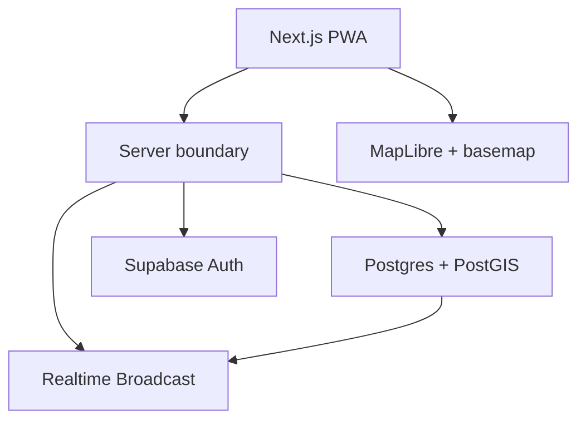

# Vietnam Social Architecture

Status: first local implementation for MVP v0.1; no production deployment.

## System shape

Vietnam Social starts as a modular monolith. One Next.js application owns the user experience and server boundary. Supabase supplies authentication, PostgreSQL/PostGIS, storage, and realtime delivery.

## Modules

- `map`: viewport, camera, clusters, Signal markers
- `signals`: lifecycle, creation, retrieval, expiry
- `trust`: confirmation, rejection, confidence calculation
- `places`: venue anchors; not a competing place database
- `auth`: session and authorization
- `moderation`: reports, resolution, rate limits
- `analytics`: privacy-preserving product events
- `geo`: PostGIS queries, H3 conversion, location approximation

Modules may share one deployable and one database, but domain logic must not be duplicated between UI, API routes, and database functions.

## First vertical slice

1. Host creates an expiring activity at a public venue.
2. The server validates the time, location policy, and authorization.
3. PostgreSQL stores the Signal with a geographic point and H3 cell.
4. A second client queries the current viewport and sees it on MapLibre.
5. The second user opens the Signal and chooses `join` or `confirm`.
6. The confidence state changes and reaches the first client without a page reload.
7. At expiry, the Signal leaves active queries and realtime views.

## Data decisions

- Use `geography(Point, 4326)` for distance-aware queries.
- Add a GiST index to geographic Signal location.
- Add partial/compound indexes that support `status = active`, time window, and city queries.
- Store venue coordinates exactly because the venue is public.
- For a non-place activity, derive an H3 cell from the submitted point, persist only what the selected privacy mode permits, and publish a cell-derived approximate point.
- Keep raw device GPS out of analytics.

## Realtime

Postgres remains the source of truth. Realtime is an invalidation and update channel, not a second database.

- Partition channels by city and coarse H3 parent cell.
- Send Signal identifiers and safe display state, not private coordinates or full user profiles.
- Re-query authoritative data after reconnect or version gaps.
- Do not subscribe the client to all HCMC events.

## Trust

MVP confidence is deterministic and explainable. It is not machine learning.

Suggested inputs:

- source class
- reporter trust band
- unique confirmations
- unique `not_there` votes
- age decay relative to Signal lifetime
- moderation state

The server produces both a numeric internal score and a public label: `unconfirmed`, `likely`, `verified`, or `questionable`. Exact weights remain configurable and require calibration from pilot data.

## Failure posture

- If realtime fails, viewport refresh still returns correct data.
- If the basemap provider fails, product data remains portable and a provider can be swapped.
- If H3 is unavailable in a request path, exact PostGIS queries remain authoritative.
- If automated expiry is delayed, all active queries still enforce `expires_at > now()`.

## Deferred architecture

Do not build chat, follower graphs, recommendation ML, merchant billing, cross-city sharding, dedicated search infrastructure, or a separate event-ingestion pipeline in v0.1.

## First-slice implementation details

`src/components/explore.tsx` owns the map/list and dialog journey; `src/components/activity-map.tsx` adapts MapLibre. API routes validate input and forward the caller JWT using the public Supabase key. Mutation authorization and domain rules live in database RPCs, with the private schema excluded from PostgREST.

`supabase/migrations/202609140001_first_slice.sql` defines the public venue catalog and private profiles/signals/actions/audit tables. Every table has RLS; only explicit public read/RPC grants are available to clients. New users always become members. Operators alone provision venue inventory and host/moderator roles.

The first slice accepts public venue IDs only. Location and H3 partitions come from the operator-owned venue record. PostGIS validates the pilot envelope and viewport; no H3 match can substitute for a geographic match. The pilot envelope is a proposed operational boundary, not a claim about administrative district borders.

The SQL projection computes confidence on read from unique current observations. Mutation audit events preserve reason codes. Natural expiry is enforced by query predicates, with visible-browser refetch at most every 15 seconds and immediate invalidation on writes. Realtime messages carry only an ID; no full row broadcasting is used.

Reference implementations used: [Next.js App Router](https://nextjs.org/docs/app/getting-started), [Supabase PostGIS](https://supabase.com/docs/guides/database/extensions/postgis), [database Broadcast](https://supabase.com/docs/guides/realtime/broadcast), and [MapLibre map initialization](https://maplibre.org/maplibre-gl-js/docs/examples/display-a-map/).
