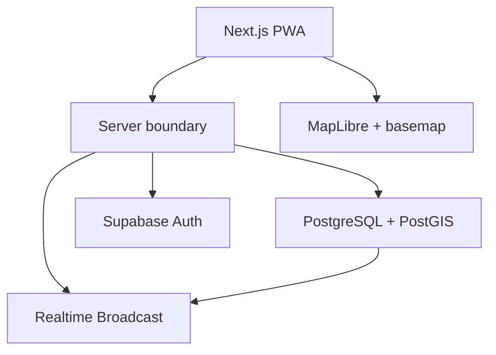

# Vietnam Social Architecture

Status: HCMC foundation, Activities, Local Posts (Phase B), Communities core (Phase C), and Rich Places + Area Following (Phase D) are technically shipped. Deployment and market/retention validation are separate gates. No broad adoption is claimed.

## 1. System shape

Vietnam Social remains a **modular monolith**. One Next.js application owns the user experience and server boundary. Supabase supplies authentication, PostgreSQL/PostGIS, storage, and realtime delivery.



Do not split the system into microservices merely because the product now has more social primitives. Domain modularity comes before deployment fragmentation.

## 2. Product composition

The target product consists of five first-class social primitives connected by the map:

```text
People ─────┐
Local Posts ├────► Map / Area Context ◄──── Places
Communities ┤
Activities ─┘
```

The map is a composition/discovery surface. It is not a database or a second source of truth.

## 3. Domain modules

### `city`

- city domain model
- launch state
- PostGIS operational boundary
- city defaults and rollout state

### `map`

- viewport and camera state
- zoom-dependent layer composition
- entity clustering/aggregation
- area selection
- accessible list fallback
- honest empty-area UX

### `profiles`

- public social identity
- safe profile projection
- contribution history
- trust/moderation state where appropriate
- never precise live location

### `posts`

- Local Post creation and lifecycle
- safe place/coarse-area attachment
- post detail
- reactions
- comments/replies
- moderation state
- discovery projection

### `social-graph`

Implemented edges:

- person follows person
- user follows approved public Place
- user follows catalog-recognized coarse `(city_id, area)`

Community membership is a separate edge with its own authorization. No follow implicitly joins a Community, and membership does not imply Place/Area following.

Graph relationships must not grant access to private or precise location data.

### `communities`

Implemented core for persistent groups organized around an interest, institution, locality, or recurring activity. Core responsibilities include:

- public community identity
- membership
- owner protection and member-scoped Local Posts
- moderation
- optional Activity linkage in the database
- public Place/Area anchoring

Richer administration and Activity ↔ Community UX are deferred.

### `signals` / `activities`

Existing Activity system:

- creation
- public-place anchoring
- discovery
- time window
- expiry
- join/go
- confirm/not-there
- confidence
- sharing
- moderation

Activity is now one primitive of the social network, but its time-bounded invariants remain intact.

### `places`

- approved public physical anchors
- geographic truth for exact public pins
- social aggregation surface for posts/activities/communities

Vietnam Social adds social context to places; it should not become a generic global place database.

### `trust`

- deterministic trust inputs
- progressive-trust state
- activity confidence
- contribution reputation inputs where justified
- explainable server-owned decisions

### `moderation`

- reports
- quarantine/removal state
- rate limits
- abuse controls
- audit trail

Raw report count alone should not become a trivially weaponized permanent-deletion rule.

### `analytics`

- strongly typed privacy-preserving product events
- coarse geographic context only
- explicit real/demo/test separation
- versioned definitions for investment metrics

### `notifications`

Deferred until required by a validated social slice. When introduced, notifications should be event-derived delivery state, not a new source of product truth.

### `logger`

- structured observability
- automatic redaction of secrets, tokens, credentials, and coordinate-like sensitive fields

### `env`

- runtime environment validation (`demo`, `local`, `staging`, `production`)
- fail-fast security checks

### `geo`

- PostGIS queries
- H3 conversion/aggregation/approximation
- geographic precision policy

## 4. Source-of-truth rules

- PostgreSQL/PostGIS remains authoritative for persisted domain state and geographic truth.
- Realtime carries invalidation/update hints, not authoritative business state.
- Clients never authoritatively compute roles, moderation state, trust, author identity, or location authority.
- H3 is secondary to PostGIS. It may support aggregation, approximation, partitioning, and clustering.
- The map UI never becomes an authorization boundary.

## 5. Geographic data policy

### Approved public places

Exact coordinates may be stored and shown for public venues/places that are intended to be discoverable.

### Person-originated content

A Local Post should attach to either:

1. an approved public place, or
2. an appropriately coarse area representation.

Do not publish a person's raw device coordinates as a social marker.

### Profiles

A profile may express a broad home/interest area only through an explicitly designed privacy-safe field. Presence must not be inferred from a user's current GPS.

### Analytics

Raw device GPS remains prohibited.

## 6. Map entity architecture

The first implementation used Activity markers only. PRD v1 requires the map to support multiple social entity types without turning into visual clutter.

A future map entity projection should provide a common display envelope rather than forcing every domain table into one generic object model.

Conceptual projection:

```ts
type MapEntity = {
  id: string;
  kind: "local_post" | "activity" | "community" | "place";
  cityId: string;
  publicPosition?: [number, number];
  coarseAreaId?: string;
  title: string;
  freshness?: string;
  trustState?: string;
};
```

This is an interface concept, not a schema mandate.

Important:

- People are not a default map-marker kind.
- Different primitives retain their own domain lifecycle.
- Map projections must contain only safe public fields.

## 7. Implemented Local Post architecture

The Phase B slice is:

`Create Local Post → discover on map → open → react/comment → profile → follow`

Architectural boundaries:

### Persistence

- private/public-safe profile projection as needed
- Local Posts
- reactions
- comments
- follows
- audit/moderation records

### Authorization

- authenticated creation
- ownership checks
- idempotent reactions/follows
- no self-follow
- RLS on every exposed table
- server-owned moderation state

### Geography

A post must point to:

- approved `place_id`, or
- coarse area reference derived through a server-approved path

The client must not be able to declare arbitrary precise location authority.

### Discovery

Initial Local Post discovery should be based on understandable inputs:

- viewport/area
- place relevance
- freshness
- moderation/trust state
- limited basic engagement inputs

Do not introduce recommendation ML for the first slice.

### Realtime

Realtime may invalidate post/comment/reaction projections, but clients must re-fetch authoritative state after receiving an update.

## 8. Existing Activity architecture

The first shipped vertical slice remains valid:

1. Host creates an expiring Activity at a public venue.
2. Server validates time, location policy, and authorization.
3. PostgreSQL stores the Signal with geography and H3 context.
4. Another client discovers it through the current viewport.
5. User opens and chooses join/go/confirm actions.
6. Confidence state changes server-side.
7. Realtime invalidates clients.
8. At expiry, the Activity leaves active queries.

Existing guarantees stay in place until an explicit Activity permission redesign is implemented:

- venue authorization
- expiry
- confidence
- idempotent actions
- moderation
- analytics privacy
- real/demo/test evidence separation

## 9. Realtime

Postgres remains the source of truth.

Guidelines:

- partition high-volume channels by city/coarse spatial context when useful
- send identifiers and safe display state, not private profiles or raw coordinates
- re-query after reconnect/version gaps
- avoid subscribing every client to every HCMC event
- introduce new channels only when measurement shows a need

## 10. Trust and progressive contribution

PRD v1 prefers open authenticated contribution with constrained distribution and progressive trust.

This does not mean trusting every write equally.

Controls can include:

- rate limits
- account age/history as one signal, not a sole decision
- safe place/area constraints
- content validation
- duplicate detection
- quarantine
- moderation history
- community reports with anti-brigading controls

Verified Host remains a stronger organizer tier with Activity-specific capabilities.

## 11. Failure posture

- If realtime fails, ordinary reads still return correct state.
- If basemap provider fails, product data remains portable.
- If H3 is unavailable in a request path, PostGIS remains authoritative.
- If automated Activity expiry is delayed, active queries still enforce `expires_at > now()`.
- If social ranking is unavailable, deterministic area/freshness ordering must still produce a usable local view.
- If a social write fails, the client must not optimistically fabricate durable success.

## 12. Deferred architecture

Do not build these merely because the product is now a social network:

- direct messaging infrastructure
- group chat
- story/video/livestream pipeline
- global recommendation service
- creator monetization/billing
- ad platform
- marketplace/order system
- contact-book ingestion
- cross-city sharding
- Kafka/event-sourcing infrastructure
- microservice decomposition

## 13. Current implementation details

`src/components/explore.tsx` currently owns the map/list and Activity dialog journey; `src/components/activity-map.tsx` adapts MapLibre.

Current migrations implement:

- city foundation and PostGIS operational boundaries
- approved places
- profiles
- Activity Signals/actions/audit state
- Activity host invitation/onboarding
- host-venue authorization
- templates
- venue suggestions
- analytics event storage
- operator supply metrics

These are **current implementation facts**, not the full target social schema.

### Phase D Place and Area relationships

Migration `202609140008_rich_places_area_following.sql` adds private `place_follows` and `area_follows` tables, RLS without direct client grants, and constrained RPCs with fixed empty `search_path` and explicit execute grants.

- `get_place_social_page(uuid)`: public Place identity, viewer state/counts, up to 30 Posts, 20 discoverable Activities and 20 Communities using existing domain projections.
- `set_place_follow(uuid, boolean)` and `set_area_follow(text, text, boolean)`: authenticated explicit intent, null rejection, advisory-lock serialization and idempotent insert/delete. Area identity is canonicalized from the active approved Place catalog.
- `get_my_local_follows()`: only the authenticated viewer's Place/Area edges, public Place coordinates and coarse Area identity/city name; no follower identity list or private location.
- `get_area_social_page(text, text)`: public, catalog-recognized area context with up to 30 approved Places/Posts and 20 Activities/Communities. Existing Posts/Communities are HCMC-only in migrations 006/007; this is explicit in the area query.

`/p/[id]`, `/following` and `/a?city_id=hcm&area=…` share presentation of existing social objects. Contextual Place discovery is a deterministic list of at most 12 approved Places within the current viewport. No permanent business-pin flood or external POI product is added.

Public projection RPCs deliberately permit anonymous execution; mutations/private collections require authentication. Advisor notices for intentional SECURITY DEFINER entry points and private deny-by-default RLS tables must be reviewed against these grants, not silenced by broad permissions.

Real-world market validation and retention validation have NOT passed merely because the code shipped. Production migration history and authenticated browser evidence are separate from local/CI tests.

## 14. Task history

### Task 001 — Activity vertical slice

Established the first map → Activity → action loop.

### Task 002 — HCMC production foundation

Extended city/domain/environment/analytics/observability foundations and HCMC operational support.

### Task 003 — HCMC supply system

Added host invitation, onboarding, host-venue membership, venue suggestions, templates, analytics evidence separation, and operator supply tooling.

### PRD v1 foundation reset

Reframes the existing Activity implementation as one primitive inside Vietnam Social's broader map-native social network.

No documentation update alone constitutes market validation or a shipped social-network feature.
