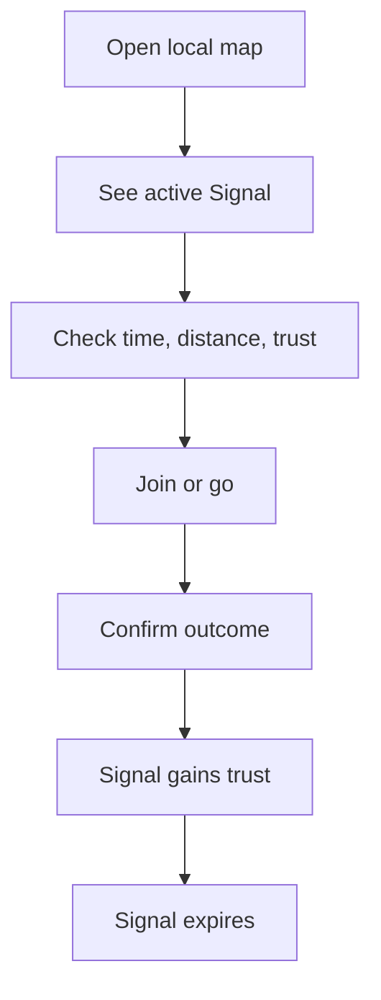

# Vietnam Social PRD v0.1

Status: ready for validation, not yet approved for full build.

## 1. Problem

Useful local information in Ho Chi Minh City is fragmented across Facebook groups, Zalo groups, venue pages, event listings, and word of mouth. It is difficult to answer a time-sensitive question from one place:

> What can I join or go to near me in the next few hours?

Static place listings answer what exists, but not reliably what is happening now. Traditional social feeds are not organized by distance, expiry, or verifiability.

## 2. Target user

Primary demand user:

- lives or spends time in the pilot cluster
- has an unplanned window in the next 0–6 hours
- is willing to travel roughly 1–5 km
- wants a concrete activity, not endless browsing

Primary supply user:

- organizes recurring local activities or operates a venue
- already posts into Zalo, Facebook, Messenger, or community groups
- needs last-minute attendance, participants, or visibility

Examples: badminton hosts, running clubs, acoustic venues, workshops, language exchanges, and small community events.

## 3. Job to be done

When I have free time soon, help me find a credible nearby activity and decide quickly whether to go or join.

For a host: when an activity needs participants soon, let me publish it once and share a live, expiring page that converts viewers into joins.

## 4. Value proposition

- nearby and time-bounded
- clear action, availability, and distance
- source and confidence visible
- automatically removed when no longer relevant
- shareable outside the product

## 5. MVP hypothesis

If the product provides a dense set of credible, expiring activities within one compact area, users will take `join` or `go` actions and return when they next have free time.

The riskiest assumption is **supply density**, not map technology.

## 6. Seven-day pre-code evidence gate

Before building the full map, manually recruit at least 15 potential hosts across at least three activity categories in the proposed cluster.

Pass conditions:

- at least 10 hosts agree to a real pilot
- at least 6 hosts each provide two upcoming activities or recurring time slots
- at least 30 genuine activity records can be collected for a seven-day window
- at least 50 target users review a clickable/mock listing or manually curated page
- at least 15 users attempt a meaningful action: join, ask for details, navigate, or save/share
- at least 5 users return voluntarily during the seven days

If host supply fails, do not solve it with more code. Change the category, cluster, or host value proposition.

## 7. Core loop

## 8. MVP scope

### Included

- responsive map-first web/PWA shell
- current-location permission requested only after user intent
- pilot-area viewport and active Signal markers
- list fallback for accessibility and low-end devices
- Signal detail with title, venue/approximate area, start, expiry, distance, capacity note, source, confidence, and action
- authenticated host Signal creation
- `join`, `go`, `confirm`, and `not_there` actions
- shareable Signal URL with useful preview metadata
- automatic expiry and active-query filtering
- simple reporter/host trust band
- abuse report and moderation state
- basic operational admin view
- analytics events defined below

### Explicitly excluded

- friend location
- public nearby-person markers
- continuous GPS tracking
- direct messaging or group chat
- followers, stories, generic posts, or infinite feed
- user video/livestream
- marketplace or delivery
- reviews and star ratings
- ticket payments
- merchant ads/promoted Signals
- recommendation ML
- nationwide or full-city launch

## 9. Signal model

Required public fields:

- `id`
- `type = ACTIVITY`
- `title`
- optional short description
- `source_type`: host, venue, community, structured
- source label
- public venue or approximate area
- `starts_at`
- `expires_at`
- optional capacity status
- confidence label
- confirmation count
- join/go count, subject to privacy threshold
- primary action

Internal fields include author, exact authorized storage location if applicable, geography, H3 cell, moderation state, trust inputs, timestamps, and audit metadata.

## 10. Lifecycle

`draft → active → resolved | expired | removed`

Rules:

- `expires_at` is mandatory and later than `starts_at`.
- normal activity lifetime is no more than 24 hours after start unless a product rule explicitly permits it.
- active query requires `status = active`, `starts_at` within the supported window, and `expires_at > now()`.
- a host may resolve their Signal early.
- moderation may remove a Signal immediately.
- expiry must remain correct even if a scheduled job is delayed.

## 11. Confidence v0

Public labels:

- `unconfirmed`
- `likely`
- `verified`
- `questionable`

Inputs:

- verified/known host band
- source class
- unique confirmations
- unique `not_there` votes
- age relative to expected lifetime
- moderation reports

Requirements:

- deterministic and server-owned
- idempotent per user/action
- resistant to a host confirming their own Signal
- weights stored in configuration or a versioned database function
- every score change auditable by reason code

The score is a decision aid, not a guarantee of truth.

## 12. Privacy and safety

- location permission is contextual and optional for browsing
- anonymous browsing uses a selected area or coarse default
- no continuous background collection
- exact public coordinate only for a public venue or explicitly safe place anchor
- non-place user activity exposes an approximate area derived from a coarse geo cell
- analytics do not receive raw GPS
- user content supports deletion and retention rules
- consent and policy version are recorded where required
- all client-accessible tables use RLS
- creation, reaction, joining, confirmation, and reporting are rate-limited
- block obvious self-confirmation and repeated-vote abuse

Legal compliance must be reviewed by qualified Vietnamese counsel before public launch; the product must be designed for the applicable personal-data rules, but this PRD is not legal advice.

## 13. Cold-start operations

Use honest sources:

1. host-submitted activities
2. venue-submitted activities
3. structured public listings with source attribution
4. community Signals from authenticated users

No fake community activity or synthetic confirmation counts.

Pilot playbook:

- recruit 10–20 hosts personally
- provide a two-minute publishing flow
- generate a share link for the host's existing group
- manually verify and correct the first 100 Signals
- interview both converters and non-converters each week

## 14. Metrics

### North-star candidate

**Weekly confirmed real-world actions:** unique Signals for which a user chose join/go and later supplied an outcome confirmation, with abuse controls.

### Activation

- user opens a Signal and takes `join` or `go` within first session

### Supply health

- active Signals per square kilometer during relevant hours
- percentage of hours with at least N active Signals in the pilot area
- weekly active hosts
- host week-2 and week-4 retention
- Signals expiring with zero qualified opens

### Demand health

- qualified Signal open rate
- join/go conversion
- outcome confirmation rate
- user week-1 repeat rate
- median distance and time-to-start for converted Signals

### Trust and safety guardrails

- `not_there` rate
- report rate
- moderation reversal rate
- public precise-location incidents: target zero
- spam rate and host rejection rate

### Instrumentation events

`map_opened`, `area_selected`, `signal_impression`, `signal_opened`, `join_clicked`, `go_clicked`, `share_clicked`, `confirmation_submitted`, `not_there_submitted`, `signal_created`, `signal_expired`, `report_submitted`.

Events must use coarse location context only.

## 15. Pilot success gate

After four weeks of real use, continue investing only if:

- at least 100 real Signals were published
- at least 30% of published Signals receive a qualified open
- at least 15% of qualified opens produce join/go
- at least 25 confirmed real-world actions occur
- at least 30% of active hosts publish again in week 4
- fewer than 10% of Signals are judged stale/false by `not_there` or moderation, excluding obvious malicious attacks
- at least 20 users return in two or more separate weeks without being individually prompted

These thresholds are initial decision rules, not market truths. Record results and revise once, transparently, rather than moving targets every week.

## 16. Monetization hypothesis

Do not monetize during the first evidence phase.

If the activity loop works, test in this order:

1. host tools/subscription for recurring publishing and operational insights
2. commission on paid RSVP/tickets
3. clearly labeled promoted activity Signal

Never sell precise personal location data.

## 17. Geographic strategy and rollout

The multi-city expansion order is:

1. **Phase 1: Ho Chi Minh City** (current technical foundation)
2. **Phase 2: Hanoi** (deferred)
3. **Phase 3: Da Nang** (deferred)
4. **Phase 4: Other Vietnamese cities** (deferred)

### Invariant: Expansion is evidence-gated, not code-driven

The HCMC production foundation (Task 002) technically enables the entire HCMC operational boundary (`[106.35, 10.35, 107.05, 11.20]`), but **user adoption across HCMC remains unmeasured and unvalidated**.

Operations must deliberately concentrate supply in dense walkable/ridable clusters rather than spreading thin across the metropolitan area.

A new city phase (e.g. Hanoi or Da Nang) may only be launched when HCMC meets all pilot success criteria:

- Verified host supply density (>=15 active hosts/cluster, >=2 activities/week).
- Conversion rate (>=15% of qualified opens converting to `join` / `go`).
- Physical outcome confirmations (>=25 confirmed real-world actions).
- Host retention (>=30% repeating into month 2).
- Stale/disputed Signal rate strictly under 5%.

Building software or adding database rows for new cities without prior phase validation is explicitly prohibited.

- Phase A: seven-day manual evidence gate
- Phase B: thin vertical slice for invited hosts/users
- Phase C: four-week cluster pilot in HCMC
- Phase D: improve density, trust, and retention in HCMC clusters
- Phase E: expand to Phase 2 (Hanoi) only after HCMC success criteria hold

## 18. Open decisions

- validate final pilot cluster with host supply evidence
- select the first three activity categories
- calibrate distance defaults for HCMC travel behavior
- define moderation SLA and operator ownership
- confirm exact Vietnam privacy/compliance requirements with counsel
